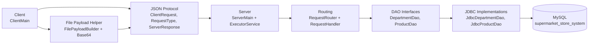

# Supermarket Store System

## 1. Project Overview

The Supermarket Store System is a multi-user Java client-server application backed by a MySQL relational database. The
system models supermarket departments and products, including operational department data, product catalogue data,
inventory fields, sale pricing, and optional image files stored as BLOB data with file metadata.

The application was developed across the required staged milestones. Stage 1 established the validated DTO classes,
database schema, JDBC DAO layer, predicate filtering, and JSON conversion. Stage 2 moved the DAO operations behind a
multithreaded socket server using a JSON protocol and a generic `ServerResponse<T>` wrapper. Stage 3 added binary file
upload and retrieval, metadata-only retrieval, clean disconnect handling, and a core JUnit 5 test suite. Stage 4 extends
the documentation and test evidence required for final submission.

## 2. Team Details

| Name | Student ID | Main area |
|:--|:--|:--|
| Hanna Bokariuk | `D00283065` | Department entity, DAO, JSON, client-server flow, binary handling, and tests |
| Nikita Smiichyk | `D00283070` | Product entity, DAO, JSON, client-server flow, binary handling, server integration, and tests |

Full contribution details are maintained in `CONTRIBUTION_MATRIX.md`.

## 3. Technology Stack

| Area | Technology |
|:--|:--|
| Language | Java 17 |
| Build tool | Maven |
| Database | MySQL |
| Persistence | JDBC with `PreparedStatement` |
| JSON | Jackson Databind |
| Networking | Java TCP sockets |
| Concurrency | `ExecutorService` |
| Testing | JUnit 5 |
| Documentation | Markdown, Mermaid, Javadoc |

## 4. Domain Model and Database

### 4.1 Entities

The project has two main domain entities.

| Entity | Table | Primary key | Main fields | Binary fields |
|:--|:--|:--|:--|:--|
| `Department` | `departments` | `department_id` | `name`, `floor`, `zone`, `budget`, `employee_count`, `is_refrigerated` | `file_name`, `content_type`, `file_size`, `department_image` |
| `Product` | `products` | `product_id` | `name`, `price`, `is_on_sale`, `discount_price`, `stock` | `file_name`, `content_type`, `file_size`, `product_image` |

The schema also contains the bridge table `department_products`, which models the many-to-many relationship between
departments and products.

### 4.2 Validation and invalid data handling

DTO fields are encapsulated and validated through constructors and setters. Examples include:

- blank or `null` names are rejected;
- negative identifiers, stock values, file sizes, and employee counts are rejected;
- product prices must be greater than zero;
- sale products require a discount price lower than the normal price;
- file metadata is validated when binary image data is present.

Invalid client requests are handled by the server without crashing. `RequestRouter` catches handler exceptions and
returns structured `ServerResponse.error(...)` replies. `ServerMain` logs invalid JSON requests, client handling errors,
client connections, and disconnections through `java.util.logging.Logger`.

### 4.3 Database setup

The database setup script is `sql/mysqlSetup.sql`. It drops and recreates the `supermarket_store_system` database,
creates the three tables, and inserts seed data:

- 12 departments;
- 21 products;
- department-product relationship rows.

## 5. How to Run

### 5.1 Prerequisites

- Java 17 or newer
- Maven
- MySQL Server
- IntelliJ IDEA for the final coverage screenshot

### 5.2 Create the database

Run the setup script in MySQL:

```bash
mysql -u root -p < sql/mysqlSetup.sql
```

The code expects this local database URL:

```text
jdbc:mysql://localhost:3306/supermarket_store_system
```

### 5.3 Configure the database password

The server and department JDBC tests read the database password from `TEST_DB_PASS`.

```bash
export TEST_DB_PASS=<your_mysql_password>
```

On the local development machine used for the latest verification run, tests were executed with:

```bash
TEST_DB_PASS=smiichyk mvn test
```

### 5.4 Run the server

Run this main class:

```text
com.supermarketstore.server.ServerMain
```

The server listens on port `9000`, accepts socket clients, and submits each connected client to the `ExecutorService`
thread pool.

### 5.5 Run one or more clients

Run this main class:

```text
com.supermarketstore.client.ClientMain
```

To demonstrate multiple simultaneous clients, start `ServerMain`, then run `ClientMain` from two IntelliJ run
configurations at the same time. The server logs each connection and handles each client through a separate worker
thread.

The console client demonstrates:

- display all departments and products;
- display one department and one product by ID;
- add, update, and delete a department;
- add, update, and delete a product;
- upload image data with metadata during add/update operations;
- retrieve image data and reconstruct files under `downloads/departments/` and `downloads/products/`;
- send a structured `DISCONNECT` request before closing the socket.

## 6. Architecture Summary

The application follows an N-tier structure. The client sends JSON requests over a TCP socket. The server parses the
request, routes it to the correct handler, calls DAO interfaces, and the JDBC DAO implementations communicate with
MySQL.



## 7. Stage 1 Evidence: DAO Layer and Full CRUD

| Feature | Requirement | Project evidence |
|:--|:--|:--|
| F1 | Entity and database setup | `Department`, `Product`, and `sql/mysqlSetup.sql` with seed data |
| F2 | DAO interface and JDBC implementation | `DepartmentDao` / `JdbcDepartmentDao`, `ProductDao` / `JdbcProductDao` |
| F3 | Get all entities | `getAllDepartments()`, `getAllProducts()` |
| F4 | Get by ID | `getDepartmentById(int)`, `getProductById(int)` return `Optional<T>` |
| F5 | Delete by ID | `deleteDepartmentById(int)`, `deleteProductById(int)` return `boolean` |
| F6 | Insert entity | `insertDepartment(...)`, `insertProduct(...)` use generated keys |
| F7 | Update entity | `updateDepartment(...)`, `updateProduct(...)` |
| F8 | Filter with predicate | `findDepartmentsByFilter(Predicate<Department>)`, `findProductsByFilter(Predicate<Product>)` |
| F9 | JSON conversion | `JacksonDepartmentJsonConverter`, `JacksonProductJsonConverter` |
| Diagram | Architecture diagram | Mermaid diagram in this README and `docs/architecture.md` |

All SQL statements in the DAO implementations use `PreparedStatement`; raw SQL string concatenation is not used for
user-supplied values.

## 8. Stage 2 Evidence: Client-Server Integration

| Feature | Requirement | Project evidence |
|:--|:--|:--|
| F10 | Multithreaded server | `ServerMain` uses `ExecutorService` and submits each client socket to the pool |
| F11 | `ServerResponse<T>` wrapper | `ServerResponse<T>` carries `status`, `message`, and `data` |
| F12 | Display by ID and display all | `GET_ALL_*` and `GET_*_BY_ID` request types for departments and products |
| F13 | Add entity | `ADD_DEPARTMENT`, `ADD_PRODUCT` |
| F14 | Delete entity | `DELETE_DEPARTMENT_BY_ID`, `DELETE_PRODUCT_BY_ID` |
| F15 | Update entity | `UPDATE_DEPARTMENT`, `UPDATE_PRODUCT` |
| F16 | Error handling and protocol | `ServerResponse.error(...)` for missing fields, invalid payloads, unknown request types, and server errors |

The server logs connection events, disconnections, invalid JSON, and handler failures. Exceptions are not propagated to
the client; clients receive structured JSON error responses.

## 9. JSON Protocol Documentation

### 9.1 Envelope format

All requests use this shape:

```json
{
  "type": "GET_PRODUCT_BY_ID",
  "payload": {
    "id": 1
  }
}
```

All responses use this shape:

```json
{
  "status": "OK",
  "message": "Product retrieved successfully",
  "data": {}
}
```

Failure responses use `status = "ERROR"` and usually return `data = null`.

### 9.2 Supported request types

| Request type | Payload | Success response |
|:--|:--|:--|
| `GET_ALL_DEPARTMENTS` | `null` | `ServerResponse<List<Department>>`, without BLOB bytes |
| `GET_DEPARTMENT_BY_ID` | `{ "id": int }` | `ServerResponse<Department>`, including metadata but not BLOB bytes |
| `GET_DEPARTMENT_IMAGE_BY_ID` | `{ "id": int }` | `ServerResponse<Department>`, including `department_image` bytes |
| `ADD_DEPARTMENT` | department fields plus optional file payload | inserted `Department` with generated `department_id` |
| `DELETE_DEPARTMENT_BY_ID` | `{ "id": int }` | success response with `data = null` |
| `UPDATE_DEPARTMENT` | `{ "id": int, ...department fields }` | updated `Department` |
| `GET_ALL_PRODUCTS` | `null` | `ServerResponse<List<Product>>`, without BLOB bytes |
| `GET_PRODUCT_BY_ID` | `{ "id": int }` | `ServerResponse<Product>`, including metadata but not BLOB bytes |
| `GET_PRODUCT_IMAGE_BY_ID` | `{ "id": int }` | `ServerResponse<Product>`, including `product_image` bytes |
| `ADD_PRODUCT` | product fields plus optional file payload | inserted `Product` with generated `product_id` |
| `DELETE_PRODUCT_BY_ID` | `{ "id": int }` | success response with `data = null` |
| `UPDATE_PRODUCT` | `{ "id": int, ...product fields }` | updated `Product` |
| `DISCONNECT` | `null` | success response, then the server closes the client loop |

### 9.3 Department JSON shape

```json
{
  "department_id": 1,
  "name": "Bakery",
  "floor": 0,
  "zone": 2,
  "budget": 12000.0,
  "employee_count": 5,
  "is_refrigerated": false,
  "file_name": "bakery.png",
  "content_type": "image/png",
  "file_size": 1234,
  "department_image": null
}
```

### 9.4 Product JSON shape

```json
{
  "product_id": 1,
  "name": "Heinz Turkish Style Garlic Sauce 420G",
  "price": 3.45,
  "is_on_sale": true,
  "discount_price": 2.50,
  "stock": 60,
  "file_data": null,
  "file_name": "sauce.jpeg",
  "content_type": "image/jpeg",
  "file_size": 1234
}
```

### 9.5 Binary upload payload fields

The client can attach these file fields to `ADD_*` and `UPDATE_*` payloads:

| Field | Meaning |
|:--|:--|
| `fileData` or `file_data` | Base64-encoded file bytes |
| `fileName` or `file_name` | Original file name |
| `contentType` or `content_type` | MIME type |
| `fileSize` or `file_size` | File size in bytes |

## 10. Stage 3 Evidence: Binary File Handling, Protocol Completion, and Testing

| Feature | Requirement | Project evidence |
|:--|:--|:--|
| F17 | Binary schema extension | Both `departments` and `products` include BLOB and metadata columns |
| F18 | Binary file upload | `FilePayloadBuilder` reads files, Base64-encodes bytes, and router decodes before DAO storage |
| F19 | Binary file retrieval | `GET_DEPARTMENT_IMAGE_BY_ID` and `GET_PRODUCT_IMAGE_BY_ID` fetch BLOB bytes and return them in `ServerResponse<T>` |
| F20 | Metadata-only query | `GET_DEPARTMENT_BY_ID` and `GET_PRODUCT_BY_ID` return `file_name`, `content_type`, and `file_size` without selecting the BLOB column |
| F21 | Disconnect / exit | `DISCONNECT` request is supported and logged |
| F22 | Core unit tests | JUnit 5 tests cover DAO reads, inserts with generated IDs, JSON conversion, validation, and binary bytes |

### 10.1 F19 Implementation Notes

Binary file retrieval is implemented for both departments and products. The client sends a request with the target `id`
using `GET_DEPARTMENT_IMAGE_BY_ID` or `GET_PRODUCT_IMAGE_BY_ID`. The server routes the request to the relevant DAO
method, which fetches the BLOB column with `ResultSet.getBytes()` and returns the entity inside `ServerResponse<T>`.
Jackson serialises the returned `byte[]` as Base64 in the JSON response and deserialises it back into a `byte[]` on the
client. The client then writes the bytes to `downloads/departments/` or `downloads/products/` using the stored
`file_name`, preserving the original filename and extension.

### 10.2 F20 Metadata-Only Retrieval Notes

The metadata-only query is implemented through `GET_DEPARTMENT_BY_ID` and `GET_PRODUCT_BY_ID`. The DAO SQL for these
methods selects `file_name`, `content_type`, and `file_size`, but deliberately does not select `department_image` or
`product_image`. Full binary data is only loaded by `getDepartmentImageById(int)` and `getProductImageById(int)`.

## 11. Stage 4 Evidence: Full Test Suite and Final Submission

### 11.1 Test suite

Current test classes:

| Test class | Main coverage |
|:--|:--|
| `DepartmentTest` | Department validation |
| `ProductTest` | Product validation, sale rules, binary metadata rules, defensive byte array copies |
| `JacksonDepartmentJsonConverterTest` | Department JSON serialisation and deserialisation |
| `JacksonProductJsonConverterTest` | Product JSON serialisation and deserialisation |
| `JdbcDepartmentDaoTest` | Department insert, update, delete, read, filter, and binary bytes |
| `JdbcProductDaoTest` | Product constructor, CRUD, read, filter, metadata-only reads, image reads, and binary bytes |

Run the suite with:

```bash
TEST_DB_PASS=smiichyk mvn test
```

Latest local verification:

```text
Tests run: 83, Failures: 0, Errors: 0, Skipped: 0
BUILD SUCCESS
```

### 11.2 Coverage evidence

Stage 4 requires the IntelliJ IDEA coverage runner to demonstrate at least 70% line coverage across the DAO, JSON
conversion, and binary file handling classes. The required evidence file is:

```text
reports/coverage.png
```

At the time this README was written, no `reports/coverage.png` file was present in the repository. Before final
submission, run the full test suite with IntelliJ coverage and save the coverage panel screenshot to that path.

### 11.3 Screencast

Required filename:

```text
2025-26-L8-OOP-GCA2-SD2a
```

The screencast should demonstrate the running server, client CRUD requests, binary upload and retrieval, metadata-only
retrieval, disconnect handling, tests, and coverage evidence.

## 12. OOP Requirements and Design Choices

| Requirement | Project evidence |
|:--|:--|
| Encapsulation | DTO fields are private and accessed through constructors/getters/setters |
| Validation | DTO setters and constructors reject invalid values |
| DAO pattern | `DepartmentDao` and `ProductDao` define persistence contracts; JDBC classes implement them |
| Interface dependency | `RequestRouter` receives DAO interfaces rather than directly depending on JDBC implementation classes |
| `Optional<T>` | DAO lookup methods return `Optional<T>` for absent records |
| Generics | `ServerResponse<T>` and typed Jackson `TypeReference` usage |
| Functional interfaces and lambdas | `Predicate<T>` filtering and lambda request handlers |
| Collections | `List<T>` for ordered results and `Map<String, RequestHandler>` for routing lookup |
| DRY principle | Shared client request helpers, shared response printing, DAO mapping helpers, and router dispatch map |
| Error handling | Structured `ServerResponse.error(...)` replies plus server-side logging |
| Javadoc | Main classes and non-trivial methods include Javadoc; generated output is under `docs/javadoc/index.html` |

### 12.1 Design patterns

DAO Pattern:
The DAO pattern separates persistence contracts from JDBC implementation details. This allows server routing code to
depend on `DepartmentDao` and `ProductDao` interfaces while the database-specific logic remains in
`JdbcDepartmentDao` and `JdbcProductDao`.

Router / Command-style Dispatch:
`RequestRouter` stores request handlers in a `Map<String, RequestHandler>`. Each request type maps to a handler lambda,
which keeps request dispatch centralised and avoids a long conditional chain inside the server loop.

## 13. Repository Evidence

| Item | Path |
|:--|:--|
| Main README | `GCA2_README.md` |
| Original stage checklist README | `README.md` |
| Database setup | `sql/mysqlSetup.sql` |
| Architecture diagram | `docs/architecture.md` |
| Generated Javadoc | `docs/javadoc/index.html` |
| Contribution matrix | `CONTRIBUTION_MATRIX.md` |
| Tests | `src/test/java` |
| Source code | `src/main/java` |

## 14. Known Final Submission Items To Check

Before final upload, confirm these items:

- `reports/coverage.png` exists and shows at least 70% line coverage for the required classes.
- The screencast is exported with filename `2025-26-L8-OOP-GCA2-SD2a`.
- `CONTRIBUTION_MATRIX.md` is complete, including any required effort/reviewer details.
- The final README required by Moodle is submitted in the expected filename/location.
- The database can be recreated from `sql/mysqlSetup.sql`.
- The server and client run from a clean checkout after setting `TEST_DB_PASS`.

## 15. References

- FasterXML (n.d.) *Jackson Databind*. Available at: <https://github.com/FasterXML/jackson-databind> (Accessed: 1 May 2026).
- JUnit Team (n.d.) *JUnit 5 User Guide*. Available at: <https://junit.org/junit5/docs/current/user-guide/> (Accessed: 1 May 2026).
- MySQL (n.d.) *MySQL Connector/J Developer Guide*. Available at: <https://dev.mysql.com/doc/connector-j/en/> (Accessed: 1 May 2026).
- Oracle (n.d.) *JDBC Basics*. Available at: <https://docs.oracle.com/javase/tutorial/jdbc/basics/index.html> (Accessed: 1 May 2026).
- Oracle (n.d.) *ExecutorService Interface*. Available at: <https://docs.oracle.com/en/java/javase/17/docs/api/java.base/java/util/concurrent/ExecutorService.html> (Accessed: 1 May 2026).

## 16. AI Tool Use Declaration

AI tools were used for support with documentation wording, README restructuring, checklist interpretation, and code
review prompts. The implementation remains the responsibility of the project team.
