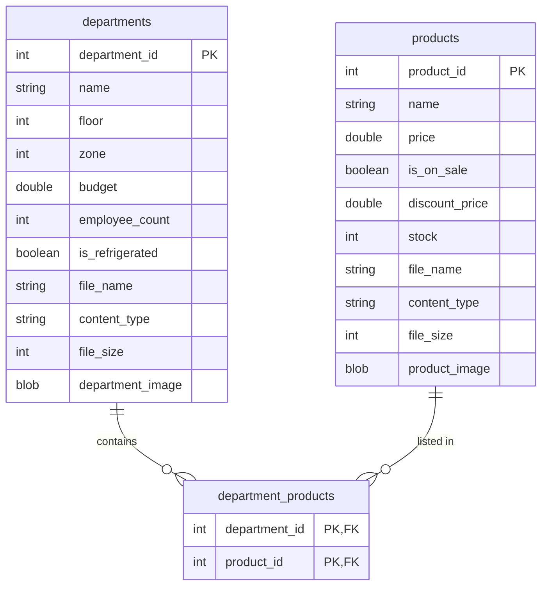
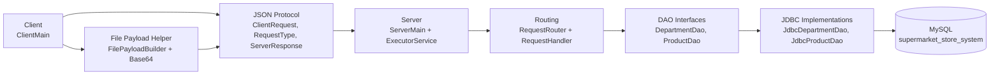
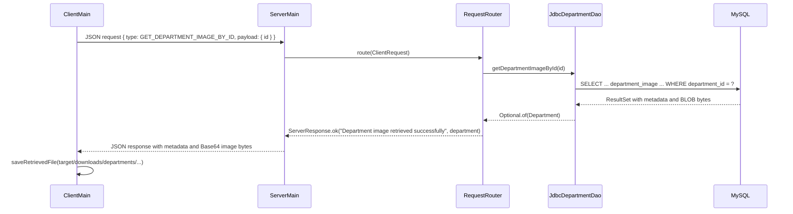
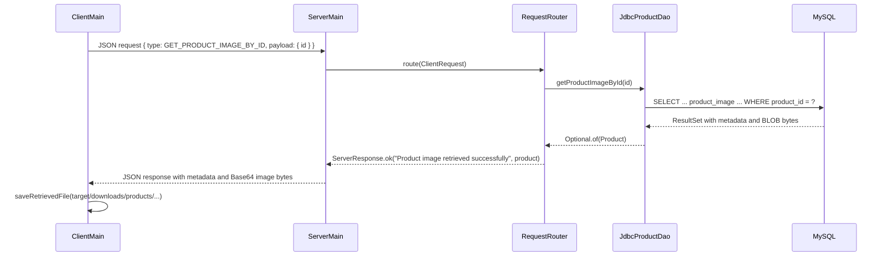

# Supermarket Store System

## 1. Project Overview

The Supermarket Store System is a multi-user Java client-server application backed by a MySQL relational database. The
system models supermarket departments and products, including operational department data, product catalogue data,
inventory fields, sale pricing, and optional image files stored as BLOB data with file metadata.

The application was developed across the required staged milestones. Stage 1 established the validated DTO classes,
database schema, JDBC DAO layer, predicate filtering, and JSON conversion. Stage 2 moved the DAO operations behind a
multithreaded socket server using a JSON protocol and a generic `ServerResponse<T>` wrapper. Stage 3 added binary file
upload and retrieval, metadata-only retrieval, clean disconnect handling, and a core JUnit 5 test suite. Stage 4 extends
the documentation and test evidence required for final submission.

## 2. Team Details

| Name | Student ID |
|:--|:--|
| Hanna Bokariuk | `D00283065` |
| Nikita Smiichyk | `D00283070` |

### 2.1 Contribution Matrix

<details>
<summary><strong>Click to expand the contribution matrix</strong></summary>

| Feature / Task | Primary author | Reviewer / contributor | Estimated effort (hours) | Notes |
|:--|:--|:--|--:|:--|
| Domain proposal and entity list | Nikita Smiichyk | Hanna Bokariuk | 2 | Supermarket domain selected with Departments and Products as the main entities. |
| Repository setup, branch structure, and Maven project setup | Nikita Smiichyk | Hanna Bokariuk | 4 | Maven Java 17 project with Jackson, MySQL Connector/J, and JUnit 5 dependencies. |
| `mysqlSetup.sql` department schema and department seed data | Hanna Bokariuk | Nikita Smiichyk | 4 | Created department table, department fields, validation-aligned columns, and seed records. |
| `mysqlSetup.sql` product schema, product seed data, and bridge table | Nikita Smiichyk | Hanna Bokariuk | 5 | Added product table, product seed data, and `department_products` relationship table. |
| Department DTO/entity modelling and validation | Hanna Bokariuk | Nikita Smiichyk | 6 | Implemented department fields, constructors, getters/setters, validation, equality, and Javadocs. |
| Product DTO/entity modelling and validation | Nikita Smiichyk | Hanna Bokariuk | 8 | Implemented product fields, sale/discount validation, JSON properties, equality, defensive byte array copying, and Javadocs. |
| Department DAO interface | Hanna Bokariuk | Nikita Smiichyk | 2 | Created `DepartmentDao` contract with CRUD, filtering, and image retrieval methods. |
| Product DAO interface | Nikita Smiichyk | Hanna Bokariuk | 2 | Created `ProductDao` contract with CRUD, filtering, and image retrieval methods. |
| Department JDBC DAO: `getAll` and `getById` | Hanna Bokariuk | Nikita Smiichyk | 4 | Implemented metadata-only department reads using `Optional<Department>` and `PreparedStatement`. |
| Product JDBC DAO: `getAll` and `getById` | Nikita Smiichyk | Hanna Bokariuk | 4 | Implemented metadata-only product reads using `Optional<Product>` and `PreparedStatement`. |
| Department JDBC DAO: insert with generated keys | Hanna Bokariuk | Nikita Smiichyk | 3 | Implemented insert and returned the generated `department_id`. |
| Product JDBC DAO: insert with generated keys | Nikita Smiichyk | Hanna Bokariuk | 4 | Implemented insert, shared parameter binding, generated key handling, and validation. |
| Department JDBC DAO: update and delete | Hanna Bokariuk | Nikita Smiichyk | 4 | Implemented department update/delete with consistent return and error behaviour. |
| Product JDBC DAO: update and delete | Nikita Smiichyk | Hanna Bokariuk | 4 | Implemented product update/delete with row-count checks and clearer SQL error handling. |
| Department predicate filtering | Hanna Bokariuk | Nikita Smiichyk | 2 | Implemented `findDepartmentsByFilter(Predicate<Department>)`. |
| Product predicate filtering | Nikita Smiichyk | Hanna Bokariuk | 2 | Implemented `findProductsByFilter(Predicate<Product>)`. |
| Department JSON conversion | Hanna Bokariuk | Nikita Smiichyk | 4 | Implemented department to/from JSON and list conversion with Jackson. |
| Product JSON conversion | Nikita Smiichyk | Hanna Bokariuk | 5 | Implemented product to/from JSON, list conversion, and error handling with Jackson. |
| Architecture diagram and tier explanation | Nikita Smiichyk | Hanna Bokariuk | 2 | Created Mermaid architecture documentation showing client, protocol, server, DAO, and database layers. |
| Multithreaded server with `ExecutorService` | Nikita Smiichyk | Hanna Bokariuk | 7 | Built socket server setup, router wiring, client handling, and per-client thread pool execution. |
| `ServerResponse<T>` wrapper and response mapping | Hanna Bokariuk | Nikita Smiichyk | 4 | Standardised server replies with `status`, `message`, and `data`; used typed responses throughout. |
| Shared request protocol classes | Nikita Smiichyk | Hanna Bokariuk | 4 | Maintained `ClientRequest`, `RequestType`, and shared request/response structure. |
| Protocol documentation in README | Nikita Smiichyk | Hanna Bokariuk | 3 | Documented request types, payloads, response shapes, binary handling, and error responses. Hanna mainly added small status/protocol notes. |
| Department client feature: display all and display by ID | Hanna Bokariuk | Nikita Smiichyk | 3 | Implemented and demonstrated department read requests over sockets. |
| Product client feature: display all and display by ID | Nikita Smiichyk | Hanna Bokariuk | 3 | Implemented and demonstrated product read requests over sockets. |
| Department client feature: insert/update/delete over sockets | Hanna Bokariuk | Nikita Smiichyk | 5 | Implemented department add, update, delete handlers and client demo verification. |
| Product client feature: insert/update/delete over sockets | Nikita Smiichyk | Hanna Bokariuk | 5 | Implemented product add, update, delete handlers and client demo verification. |
| Shared client request helper/refactoring | Nikita Smiichyk | Hanna Bokariuk | 5 | Extracted reusable request sending, entity fetching, list display, delete, and response printing helpers. |
| Error handling and server logging | Nikita Smiichyk | Hanna Bokariuk | 4 | Added structured error responses and server-side logging for invalid JSON, unknown requests, connection events, and handler failures. |
| Department binary schema extension | Hanna Bokariuk | Nikita Smiichyk | 3 | Added department image BLOB and metadata columns, later using `MEDIUMBLOB`. |
| Product binary schema extension | Nikita Smiichyk | Hanna Bokariuk | 3 | Added product image BLOB and metadata columns, later using `MEDIUMBLOB`. |
| Department binary DTO and DAO support | Hanna Bokariuk | Nikita Smiichyk | 5 | Added department image bytes, file metadata, DAO storage, and image retrieval. |
| Product binary DTO and DAO support | Nikita Smiichyk | Hanna Bokariuk | 6 | Added product image bytes, metadata validation, DAO storage, metadata-only mapping, and image retrieval. |
| Shared binary upload payload builder | Nikita Smiichyk | Hanna Bokariuk | 4 | Created `FilePayloadBuilder` to read files, Base64-encode bytes, and add file metadata to JSON payloads. |
| Department binary upload over sockets | Hanna Bokariuk | Nikita Smiichyk | 4 | Added department file payload handling to add/update requests and stored bytes/metadata in the database. |
| Product binary upload over sockets | Nikita Smiichyk | Hanna Bokariuk | 4 | Added product file payload handling, Base64 decoding, validation, and database storage. |
| Department binary retrieval and client file reconstruction | Hanna Bokariuk | Nikita Smiichyk | 5 | Implemented department image retrieval request, DAO BLOB fetch, client-side metadata printing, and file saving. |
| Product binary retrieval and client file reconstruction | Nikita Smiichyk | Hanna Bokariuk | 5 | Implemented product image retrieval request, DAO BLOB fetch, metadata-only separation, and file retrieval flow. |
| Metadata-only query without BLOB fetch | Nikita Smiichyk | Hanna Bokariuk | 3 | Implemented through `GET_DEPARTMENT_BY_ID` and `GET_PRODUCT_BY_ID`, where DAO SQL selects metadata but not BLOB columns. |
| Disconnect protocol and cleanup | Hanna Bokariuk | Nikita Smiichyk | 3 | Added `DISCONNECT`, route handling, client request before shutdown, and clean server client-loop exit. |
| Department Stage 3 core tests | Hanna Bokariuk | Nikita Smiichyk | 5 | Added department DAO read/insert/update/delete/filter tests and JSON round-trip tests. |
| Product Stage 3 core tests | Nikita Smiichyk | Hanna Bokariuk | 6 | Added product DAO read/insert/update/delete/filter tests and JSON round-trip tests. |
| Department binary tests | Hanna Bokariuk | Nikita Smiichyk | 3 | Added department DAO file metadata and image byte assertions. |
| Product binary tests | Nikita Smiichyk | Hanna Bokariuk | 4 | Added product metadata-only read tests, image retrieval tests, and binary byte assertions. |
| Product extended validation and failure tests | Nikita Smiichyk | Hanna Bokariuk | 8 | Added product constructor, validation, JSON failure, DAO connection failure, and database failure tests. |
| Test clean-up and fixture management | Nikita Smiichyk | Hanna Bokariuk | 4 | Added test row cleanup for product DAO tests and removed low-value product tests. |
| Generated Javadocs and documentation organisation | Nikita Smiichyk | Hanna Bokariuk | 3 | Generated and organised Javadocs under `docs/javadoc`; Hanna added department class documentation. |
| Final README | Nikita Smiichyk | Hanna Bokariuk | 2 | Wrote final project overview, run instructions, protocol docs, stage evidence, binary notes, OOP features, references, and submission checklist. |
| Contribution matrix | Nikita Smiichyk | Hanna Bokariuk | 3 | Reworked the matrix into the final Stage 4 table format based on Git history and task ownership. |
| Assessment checklist and final submission notes | Nikita Smiichyk | Hanna Bokariuk | 1 | Added final checklist, assessment rubric notes, stage tracking, and final submission reminders. |
| Coverage evidence screenshot `/reports/coverage.png` | Nikita Smiichyk | Hanna Bokariuk | 1 | Must be generated in IntelliJ IDEA using the full test suite before final submission. |
| Screencast planning and export | Hanna Bokariuk | Nikita Smiichyk | 3 | Should cover both vertical slices, server/client demo, binary handling, tests, and design explanation. |
| Harvard references and AI usage declaration | Nikita Smiichyk | Hanna Bokariuk | 2 | Added references and AI tool use declaration in the final README. |
| Final code formatting and clean-up | Nikita Smiichyk | Hanna Bokariuk | 3 | Performed project-wide formatting, package clean-up, unused asset removal, and shared refactoring. |

</details>

## 3. Technology Stack

| Area | Technology |
|:--|:--|
| Language | Java 17 |
| Build tool | Maven |
| Database | MySQL |
| Persistence | JDBC with `PreparedStatement` |
| JSON | Jackson Databind |
| Networking | Java TCP sockets |
| Concurrency | `ExecutorService` |
| Testing | JUnit 5 |
| Documentation | Markdown, Mermaid, Javadoc |

### 3.1 Project Structure

The project follows the standard Maven directory layout, with additional folders for database scripts, generated
documentation, coverage evidence, and runtime output.

```text
OOP-GCA2/
+-- README.md                         # Final project documentation and submission evidence
+-- pom.xml                           # Maven configuration, dependencies, and build settings
+-- sql/
�   +-- mysqlSetup.sql                # Recreates and seeds the MySQL database from scratch
+-- src/
�   +-- main/
�   �   +-- java/com/supermarketstore/
�   �   �   +-- client/               # Console client and socket request helpers
�   �   �   +-- client/upload/        # Binary file payload creation for uploads
�   �   �   +-- department/           # Department DTO, DAO interface, JDBC DAO, and JSON converter
�   �   �   +-- product/              # Product DTO, DAO interface, JDBC DAO, and JSON converter
�   �   �   +-- protocol/             # ClientRequest, RequestType, and ServerResponse classes
�   �   �   +-- server/               # Multithreaded server, routing, and request handling
�   �   +-- resources/images/         # Sample department and product image files
�   +-- test/java/com/supermarketstore/
�       +-- department/               # Department DAO, JSON, and binary handling tests
�       +-- product/                  # Product DAO, JSON, validation, and binary handling tests
�       +-- protocol/                 # Shared protocol wrapper and Base64 round-trip tests
�       +-- server/routing/           # RequestRouter request/response scenario tests
+-- docs/
�   +-- javadoc/                      # Generated Javadoc website, including index.html
+-- reports/
�   +-- coverage.png                  # IntelliJ IDEA coverage evidence for Stage 4
+-- lib/                              # Local library folder, if required by the environment
+-- target/                           # Maven build output generated locally
    +-- downloads/
        +-- departments/              # Reconstructed department files downloaded by the client
        +-- products/                 # Reconstructed product files downloaded by the client
```

## 4. Domain Model and Database

### 4.1 Entities

The project has two main domain entities.

| Entity | Table | Primary key | Main fields | Binary fields |
|:--|:--|:--|:--|:--|
| `Department` | `departments` | `department_id` | `name`, `floor`, `zone`, `budget`, `employee_count`, `is_refrigerated` | `file_name`, `content_type`, `file_size`, `department_image` |
| `Product` | `products` | `product_id` | `name`, `price`, `is_on_sale`, `discount_price`, `stock` | `file_name`, `content_type`, `file_size`, `product_image` |

The schema also contains the bridge table `department_products`, which models the many-to-many relationship between
departments and products.


### 4.2 Validation and invalid data handling

DTO fields are encapsulated and validated through constructors and setters. Examples include:

- blank or `null` names are rejected;
- negative identifiers, stock values, file sizes, and employee counts are rejected;
- product prices must be greater than zero;
- sale products require a discount price lower than the normal price;
- file metadata is validated when binary image data is present.

Invalid client requests are handled by the server without crashing. `RequestRouter` catches handler exceptions and
returns structured `ServerResponse.error(...)` replies. `ServerMain` logs invalid JSON requests, client handling errors,
client connections, and disconnections through `java.util.logging.Logger`.

### 4.3 Database setup

The database setup script is `sql/mysqlSetup.sql`. It drops and recreates the `supermarket_store_system` database,
creates the three tables, and inserts seed data:

- 12 departments;
- 21 products;
- department-product relationship rows.

## 5. How to Run

### 5.1 Prerequisites

- Java 17 or newer
- Maven
- MySQL Server
- IntelliJ IDEA for the final coverage screenshot

### 5.2 Create the database

Run the setup script in MySQL:

```bash
mysql -u root -p < sql/mysqlSetup.sql
```

The code expects this local database URL:

```text
jdbc:mysql://localhost:3306/supermarket_store_system
```

### 5.3 Configure the database password

The server and JDBC DAO tests read the database password from `TEST_DB_PASS`.

```bash
export TEST_DB_PASS=<your_mysql_password>
```

### 5.4 Run the server

Run this main class:

```text
com.supermarketstore.server.ServerMain
```

The server listens on port `9000`, accepts socket clients, and submits each connected client to the `ExecutorService`
thread pool.

### 5.5 Run one or more clients

Run this main class:

```text
com.supermarketstore.client.ClientMain
```

To demonstrate multiple simultaneous clients, start `ServerMain`, then run `ClientMain` from two IntelliJ run
configurations at the same time. The server logs each connection and handles each client through a separate worker
thread.

The console client demonstrates:

- display all departments and products;
- display one department and one product by ID;
- add, update, and delete a department;
- add, update, and delete a product;
- upload image data with metadata during add/update operations;
- retrieve image data and reconstruct files under `target/downloads/departments/` and `target/downloads/products/`;
- send a structured `DISCONNECT` request before closing the socket.

## 6. Architecture Summary

The application follows an N-tier structure. The client sends JSON requests over a TCP socket. The server parses the
request, routes it to the correct handler, calls DAO interfaces, and the JDBC DAO implementations communicate with
MySQL.



## 7. Stage 1 Evidence: DAO Layer and Full CRUD

| Feature | Requirement | Project evidence |
|:--|:--|:--|
| F1 | Entity and database setup | `Department`, `Product`, and `sql/mysqlSetup.sql` with seed data |
| F2 | DAO interface and JDBC implementation | `DepartmentDao` / `JdbcDepartmentDao`, `ProductDao` / `JdbcProductDao` |
| F3 | Get all entities | `getAllDepartments()`, `getAllProducts()` |
| F4 | Get by ID | `getDepartmentById(int)`, `getProductById(int)` return `Optional<T>` |
| F5 | Delete by ID | `deleteDepartmentById(int)`, `deleteProductById(int)` return `boolean` |
| F6 | Insert entity | `insertDepartment(...)`, `insertProduct(...)` use generated keys |
| F7 | Update entity | `updateDepartment(...)`, `updateProduct(...)` |
| F8 | Filter with predicate | `findDepartmentsByFilter(Predicate<Department>)`, `findProductsByFilter(Predicate<Product>)` |
| F9 | JSON conversion | `JacksonDepartmentJsonConverter`, `JacksonProductJsonConverter` |
| Diagram | Architecture diagram | Mermaid diagram in this README and `docs/architecture.md` |

All SQL statements in the DAO implementations use `PreparedStatement`; raw SQL string concatenation is not used for
user-supplied values.

## 8. Stage 2 Evidence: Client-Server Integration

| Feature | Requirement | Project evidence |
|:--|:--|:--|
| F10 | Multithreaded server | `ServerMain` uses `ExecutorService` and submits each client socket to the pool |
| F11 | `ServerResponse<T>` wrapper | `ServerResponse<T>` carries `status`, `message`, and `data` |
| F12 | Display by ID and display all | `GET_ALL_*` and `GET_*_BY_ID` request types for departments and products |
| F13 | Add entity | `ADD_DEPARTMENT`, `ADD_PRODUCT` |
| F14 | Delete entity | `DELETE_DEPARTMENT_BY_ID`, `DELETE_PRODUCT_BY_ID` |
| F15 | Update entity | `UPDATE_DEPARTMENT`, `UPDATE_PRODUCT` |
| F16 | Error handling and protocol | `ServerResponse.error(...)` for missing fields, invalid payloads, unknown request types, and server errors |

The server logs connection events, disconnections, invalid JSON, and handler failures. Exceptions are not propagated to
the client; clients receive structured JSON error responses.

## 9. JSON Protocol Documentation

### 9.1 Envelope format

All requests use this shape:

```json
{
  "type": "GET_PRODUCT_BY_ID",
  "payload": {
    "id": 1
  }
}
```

All responses use this shape:

```json
{
  "status": "OK",
  "message": "Product retrieved successfully",
  "data": {}
}
```

Failure responses use `status = "ERROR"` and usually return `data = null`.

### 9.2 Supported request types

| Request type | Payload | Success response |
|:--|:--|:--|
| `GET_ALL_DEPARTMENTS` | `null` | `ServerResponse<List<Department>>`, without BLOB bytes |
| `GET_DEPARTMENT_BY_ID` | `{ "id": int }` | `ServerResponse<Department>`, including metadata but not BLOB bytes |
| `GET_DEPARTMENT_IMAGE_BY_ID` | `{ "id": int }` | `ServerResponse<Department>`, including `department_image` bytes |
| `ADD_DEPARTMENT` | department fields plus optional file payload | inserted `Department` with generated `department_id` |
| `DELETE_DEPARTMENT_BY_ID` | `{ "id": int }` | success response with `data = null` |
| `UPDATE_DEPARTMENT` | `{ "id": int, ...department fields }` | updated `Department` |
| `GET_ALL_PRODUCTS` | `null` | `ServerResponse<List<Product>>`, without BLOB bytes |
| `GET_PRODUCT_BY_ID` | `{ "id": int }` | `ServerResponse<Product>`, including metadata but not BLOB bytes |
| `GET_PRODUCT_IMAGE_BY_ID` | `{ "id": int }` | `ServerResponse<Product>`, including `product_image` bytes |
| `ADD_PRODUCT` | product fields plus optional file payload | inserted `Product` with generated `product_id` |
| `DELETE_PRODUCT_BY_ID` | `{ "id": int }` | success response with `data = null` |
| `UPDATE_PRODUCT` | `{ "id": int, ...product fields }` | updated `Product` |
| `DISCONNECT` | `null` | success response, then the server closes the client loop |

### 9.3 Department JSON shape

```json
{
  "department_id": 1,
  "name": "Bakery",
  "floor": 0,
  "zone": 2,
  "budget": 12000.0,
  "employee_count": 5,
  "is_refrigerated": false,
  "file_name": "bakery.png",
  "content_type": "image/png",
  "file_size": 1234,
  "department_image": null
}
```

### 9.4 Product JSON shape

```json
{
  "product_id": 1,
  "name": "Heinz Turkish Style Garlic Sauce 420G",
  "price": 3.45,
  "is_on_sale": true,
  "discount_price": 2.50,
  "stock": 60,
  "product_image": null,
  "file_name": "sauce.jpeg",
  "content_type": "image/jpeg",
  "file_size": 1234
}
```

### 9.5 Binary upload payload fields

The client can attach these file fields to `ADD_*` and `UPDATE_*` payloads:

| Field | Meaning |
|:--|:--|
| `fileData` or `file_data` | Base64-encoded file bytes |
| `fileName` or `file_name` | Original file name |
| `contentType` or `content_type` | MIME type |
| `fileSize` or `file_size` | File size in bytes |

### 9.6 Sequence diagram: GET_DEPARTMENT_IMAGE_BY_ID



### 9.7 Sequence diagram: GET_PRODUCT_IMAGE_BY_ID


## 10. Stage 3 Evidence: Binary File Handling, Protocol Completion, and Testing

| Feature | Requirement | Project evidence |
|:--|:--|:--|
| F17 | Binary schema extension | Both `departments` and `products` include BLOB and metadata columns |
| F18 | Binary file upload | `FilePayloadBuilder` reads files, Base64-encodes bytes, and router decodes before DAO storage |
| F19 | Binary file retrieval | `GET_DEPARTMENT_IMAGE_BY_ID` and `GET_PRODUCT_IMAGE_BY_ID` fetch BLOB bytes and return them in `ServerResponse<T>` |
| F20 | Metadata-only query | `GET_DEPARTMENT_BY_ID` and `GET_PRODUCT_BY_ID` return `file_name`, `content_type`, and `file_size` without selecting the BLOB column |
| F21 | Disconnect / exit | `DISCONNECT` request is supported and logged |
| F22 | Core unit tests | JUnit 5 tests cover DAO reads, inserts with generated IDs, JSON conversion, validation, and binary bytes |

### 10.1 F19 Implementation Notes

Binary file retrieval is implemented for both departments and products. The client sends a request with the target `id`
using `GET_DEPARTMENT_IMAGE_BY_ID` or `GET_PRODUCT_IMAGE_BY_ID`. The server routes the request to the relevant DAO
method, which fetches the BLOB column with `ResultSet.getBytes()` and returns the entity inside `ServerResponse<T>`.
Jackson serialises the returned `byte[]` as Base64 in the JSON response and deserialises it back into a `byte[]` on the
client. The client then writes the bytes to `target/downloads/departments/` or `target/downloads/products/` using the stored
`file_name`, preserving the original filename and extension.

### 10.2 F20 Metadata-Only Retrieval Notes

The metadata-only query is implemented through `GET_DEPARTMENT_BY_ID` and `GET_PRODUCT_BY_ID`. The DAO SQL for these
methods selects `file_name`, `content_type`, and `file_size`, but deliberately does not select `department_image` or
`product_image`. Full binary data is only loaded by `getDepartmentImageById(int)` and `getProductImageById(int)`.

## 11. Stage 4 Evidence: Full Test Suite and Final Submission

### 11.1 Test suite

Current test classes:

| Test class | Main coverage |
|:--|:--|
| `DepartmentTest` | Department validation |
| `ProductTest` | Product validation, sale rules, binary metadata rules, defensive byte array copies |
| `JacksonDepartmentJsonConverterTest` | Department JSON serialisation and deserialisation |
| `JacksonProductJsonConverterTest` | Product JSON serialisation and deserialisation |
| `JdbcDepartmentDaoTest` | Department getAll, getById, insert, update, delete, filter, metadata-only reads, and binary bytes |
| `JdbcProductDaoTest` | Product constructor, CRUD, read, filter, metadata-only reads, image reads, and binary bytes |
| `ServerResponseTest` | Generic `ServerResponse<T>` success, error, and JSON serialisation behaviour |
| `ClientRequestTest` | Shared `ClientRequest` JSON round-trip behaviour |
| `Base64EncodingTest` | Binary Base64 encode/decode round-trip assertions |
| `RequestRouterTest` | Server request/response routing scenarios, including errors, success paths, and disconnect |

Run the suite with:

```bash
TEST_DB_PASS=<your_mysql_password> mvn test
```

The Stage 4 suite covers all implemented DAO methods, JSON conversion round-trips, shared protocol helpers, at least
one server request/response scenario, and binary upload/retrieval assertions with known byte arrays.

Current suite size:

```text
123 JUnit 5 tests across department, product, protocol, client, upload, server, and router test classes
```

Latest local verification:

```text
Tests run: 123, Failures: 0, Errors: 0, Skipped: 0
BUILD SUCCESS
```

### 11.2 Coverage evidence

Stage 4 requires the IntelliJ IDEA coverage runner to demonstrate at least 70% line coverage across the DAO, JSON
conversion, and binary file handling classes. The required evidence file is:

```text
reports/coverage.png
```

The committed `reports/coverage.png` screenshot shows the IntelliJ IDEA coverage panel for the full
`com.supermarketstore` package, with 91% line coverage overall.

### 11.3 Screencast

Required filename:

```text
2025-26-L8-OOP-GCA2-SD2a
```

The screencast should demonstrate the running server, client CRUD requests, binary upload and retrieval, metadata-only
retrieval, disconnect handling, tests, and coverage evidence.

## 12. OOP Requirements and Design Choices

| Requirement | Project evidence |
|:--|:--|
| Encapsulation | DTO fields are private and accessed through constructors/getters/setters |
| Validation | DTO setters and constructors reject invalid values |
| DAO pattern | `DepartmentDao` and `ProductDao` define persistence contracts; JDBC classes implement them |
| Interface dependency | `RequestRouter` receives DAO interfaces rather than directly depending on JDBC implementation classes |
| `Optional<T>` | DAO lookup methods return `Optional<T>` for absent records |
| Generics | `ServerResponse<T>` and typed Jackson `TypeReference` usage |
| Functional interfaces and lambdas | `Predicate<T>` filtering and lambda request handlers |
| Collections | `List<T>` for ordered results and `Map<String, RequestHandler>` for routing lookup |
| DRY principle | Shared client request helpers, shared response printing, DAO mapping helpers, and router dispatch map |
| Error handling | Structured `ServerResponse.error(...)` replies plus server-side logging |
| Javadoc | Main classes and non-trivial methods include Javadoc; generated output is under `docs/javadoc/index.html` |

### 12.1 Design patterns

DAO Pattern:
The DAO pattern separates persistence contracts from JDBC implementation details. This allows server routing code to
depend on `DepartmentDao` and `ProductDao` interfaces while the database-specific logic remains in
`JdbcDepartmentDao` and `JdbcProductDao`.

Router / Command-style Dispatch:
`RequestRouter` stores request handlers in a `Map<String, RequestHandler>`. Each request type maps to a handler lambda,
which keeps request dispatch centralised and avoids a long conditional chain inside the server loop.

## 13. Known Final Submission Items To Check

Before final upload, confirm these items:

- `reports/coverage.png` exists and shows at least 70% line coverage for the required classes.
- The screencast is exported with filename `2025-26-L8-OOP-GCA2-SD2a`.
- The contribution matrix in section 2.1 is complete, including any required effort/reviewer details.
- The final README required by Moodle is submitted in the expected filename/location.
- The database can be recreated from `sql/mysqlSetup.sql`.
- The server and client run from a clean checkout after setting `TEST_DB_PASS`.

## 14. References

- Baeldung (n.d.) *Apache Maven Tutorial*. Available at: <https://www.baeldung.com/maven> (Accessed: 1 May 2026).
- GeeksforGeeks (n.d.) *Maven Tutorial*. Available at: <https://www.geeksforgeeks.org/advance-java/maven-tutorial/> (Accessed: 1 May 2026).
- Oracle (n.d.) *Using Prepared Statements*. Available at: <https://docs.oracle.com/javase/tutorial/jdbc/basics/prepared.html> (Accessed: 1 May 2026).
- Apache Maven Project (n.d.) *Introduction to the Standard Directory Layout*. Available at: <https://maven.apache.org/guides/introduction/introduction-to-the-standard-directory-layout.html> (Accessed: 1 May 2026).
- Baeldung (n.d.) *Maven Directory Structure*. Available at: <https://www.baeldung.com/maven-directory-structure> (Accessed: 1 May 2026).
- Oracle (n.d.) *Documentation Comment Specification for the Standard Doclet*. Available at: <https://docs.oracle.com/en/java/javase/17/docs/specs/javadoc/doc-comment-spec.html> (Accessed: 1 May 2026).
- Baeldung (n.d.) *Guide to Javadoc*. Available at: <https://www.baeldung.com/javadoc> (Accessed: 1 May 2026).
- Oracle (n.d.) *All About Sockets*. Available at: <https://docs.oracle.com/javase/tutorial/networking/sockets/> (Accessed: 1 May 2026).
- GeeksforGeeks (n.d.) *Socket Programming in Java*. Available at: <https://www.geeksforgeeks.org/java/socket-programming-in-java/> (Accessed: 1 May 2026).

## 15. AI Tool Use Declaration

AI tools were used to generate the main body of this README, interpret the assessment checklist,
and review wording for clarity. AI tools also helped generate the main body of the code docstrings, suggested
descriptive test method names, and suggested names for some methods and functions. AI tools were also used to help
draft the contribution matrix and estimate each team member's contribution by reviewing the project history and completed
tasks. The matrix was then checked, edited, and finalised by the team rather than being accepted as a fully automatic
assessment. AI tools also helped suggest commit message wording from short descriptions of completed changes. The
implementation, testing, review, and final submission decisions remain the responsibility of the project team.

