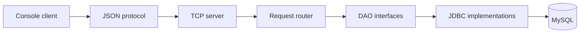
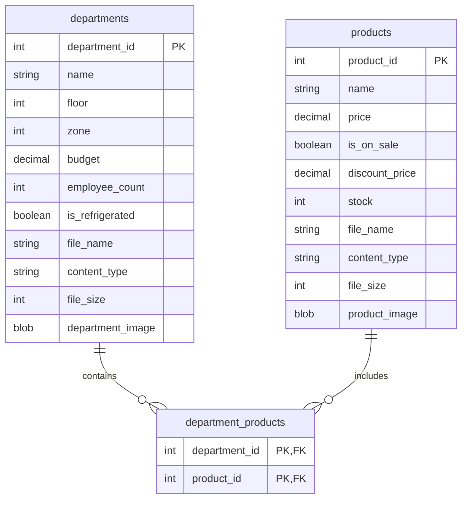

# Supermarket Store System

A Java client-server application for managing supermarket departments, products, inventory data, pricing, and associated
images. The system exposes its operations through a JSON protocol over TCP and stores persistent data in MySQL.

## Features

- Department and product CRUD operations
- Product stock, pricing, and sale-price management
- Department-to-product relationships
- Predicate-based entity filtering
- Image upload and retrieval with file metadata
- Metadata-only queries that avoid loading BLOB data
- Structured JSON success and error responses
- Concurrent client handling
- Graceful client disconnection
- Automated tests for domain validation, persistence, protocol handling, routing, and file transfers

## Technology

| Area | Technology |
|:--|:--|
| Language | Java 17 |
| Build | Maven |
| Database | MySQL |
| Persistence | JDBC |
| JSON | Jackson Databind |
| Networking | Java TCP sockets |
| Concurrency | `ExecutorService` |
| Testing | JUnit 5 |

## Architecture

The application separates client communication, request routing, domain logic, and database access. The server depends
on DAO interfaces, while JDBC implementations contain the MySQL-specific persistence logic.



Each connected client is handled by the server's thread pool. Requests are read as newline-delimited JSON, routed to a
dedicated handler, and returned as a typed `ServerResponse<T>`.

## Project Structure

```text
.
├── pom.xml
├── sql/
│   └── mysqlSetup.sql
├── src/
│   ├── main/
│   │   ├── java/com/supermarketstore/
│   │   │   ├── client/
│   │   │   ├── department/
│   │   │   ├── product/
│   │   │   ├── protocol/
│   │   │   └── server/
│   │   └── resources/images/
│   └── test/java/com/supermarketstore/
└── docs/
    └── javadoc/
```

## Requirements

- Java 17 or later
- Maven 3.8 or later
- MySQL 8 or later

## Database Setup

The application expects MySQL on `localhost:3306` and uses the
`supermarket_store_system` database.

Create and seed the database:

```bash
mysql -u root -p < sql/mysqlSetup.sql
```

The setup script recreates the schema and inserts sample departments, products, and department-product relationships.
Running it removes existing data from this database.

Set the password used by the server and database-backed tests:

```bash
export TEST_DB_PASS="your-mysql-password"
```

The current runtime configuration uses:

```text
Database URL: jdbc:mysql://localhost:3306/supermarket_store_system
Database user: root
Server port: 9000
```

## Build and Run

Compile the application:

```bash
mvn clean compile
```

Start the server:

```bash
TEST_DB_PASS="your-mysql-password" \
  mvn exec:java -Dexec.mainClass="com.supermarketstore.server.ServerMain"
```

The project does not configure the Maven Exec Plugin explicitly. If the command is unavailable in your Maven
environment, run `com.supermarketstore.server.ServerMain` from the IDE instead.

In a second terminal, start the client:

```bash
mvn exec:java -Dexec.mainClass="com.supermarketstore.client.ClientMain"
```

The console client runs an end-to-end demonstration of department and product operations. It creates temporary records,
updates and retrieves them, tests image transfer, deletes the records, and sends a `DISCONNECT` request.

Retrieved files are written to:

```text
target/downloads/departments/
target/downloads/products/
```

## Data Model

The system manages two primary entities:

| Entity | Stored data |
|:--|:--|
| `Department` | Name, floor, zone, budget, employee count, refrigeration status, and image metadata |
| `Product` | Name, price, sale status, discount price, stock, and image metadata |

The `department_products` bridge table represents the many-to-many relationship between departments and products.



## JSON Protocol

Requests and responses are each sent on a single line.

Example request:

```json
{
  "type": "GET_PRODUCT_BY_ID",
  "payload": {
    "id": 1
  }
}
```

Example success response:

```json
{
  "status": "OK",
  "message": "Product retrieved successfully",
  "data": {
    "product_id": 1,
    "name": "Example product"
  }
}
```

Error responses use the same envelope with `status` set to `ERROR` and `data` normally set to `null`.

### Supported Requests

| Request | Purpose |
|:--|:--|
| `GET_ALL_DEPARTMENTS` | Return all departments without image bytes |
| `GET_DEPARTMENT_BY_ID` | Return one department and its file metadata |
| `GET_DEPARTMENT_IMAGE_BY_ID` | Return one department with its image bytes |
| `ADD_DEPARTMENT` | Create a department |
| `UPDATE_DEPARTMENT` | Update a department |
| `DELETE_DEPARTMENT_BY_ID` | Delete a department |
| `GET_ALL_PRODUCTS` | Return all products without image bytes |
| `GET_PRODUCT_BY_ID` | Return one product and its file metadata |
| `GET_PRODUCT_IMAGE_BY_ID` | Return one product with its image bytes |
| `ADD_PRODUCT` | Create a product |
| `UPDATE_PRODUCT` | Update a product |
| `DELETE_PRODUCT_BY_ID` | Delete a product |
| `DISCONNECT` | End the current client session cleanly |

Add and update requests may include these image fields:

| Field | Description |
|:--|:--|
| `fileData` or `file_data` | Base64-encoded file content |
| `fileName` or `file_name` | Original file name |
| `contentType` or `content_type` | MIME type |
| `fileSize` or `file_size` | File size in bytes |

Standard entity queries return file metadata without selecting the BLOB column. Image bytes are loaded only through the
dedicated image requests, reducing unnecessary database and network traffic.

## Validation and Error Handling

Domain objects validate their state through constructors and setters. The validation rules reject values such as blank
names, negative identifiers or stock quantities, invalid prices, inconsistent sale prices, and incomplete file
metadata.

The server converts malformed requests, missing values, unsupported request types, and handler failures into structured
error responses. Connection events and server-side failures are recorded through `java.util.logging`.

All DAO queries use `PreparedStatement` for bound values.

## Testing

Ensure that MySQL is running and the database has been created before running the complete suite:

```bash
TEST_DB_PASS="your-mysql-password" mvn test
```

The tests cover:

- Department and product validation
- JSON serialisation and deserialisation
- JDBC CRUD operations and filtering
- Generated database identifiers
- Metadata-only and binary image retrieval
- Base64 file encoding and decoding
- Request and response models
- Request routing and error scenarios
- Client and server communication flows

## Documentation

Generated API documentation is available at:

```text
docs/javadoc/index.html
```

Regenerate it with:

```bash
mvn javadoc:javadoc
```
