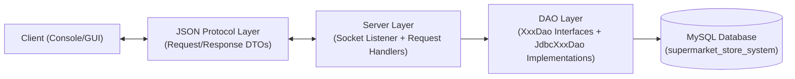

# Stage 1 Architecture Diagram

This diagram shows the required Stage 1 flow:
Client -> JSON Protocol Layer -> Server -> DAO -> Database.

## Annotations

- `Client`: sends requests and receives responses.
- `JSON Protocol Layer`: serializes and deserializes payloads to JSON.
- `Server Layer`: receives requests and delegates operations.
- `DAO Layer`: isolates persistence behind DAO interfaces and JDBC implementations.
- `Database`: stores persistent data in MySQL tables.
